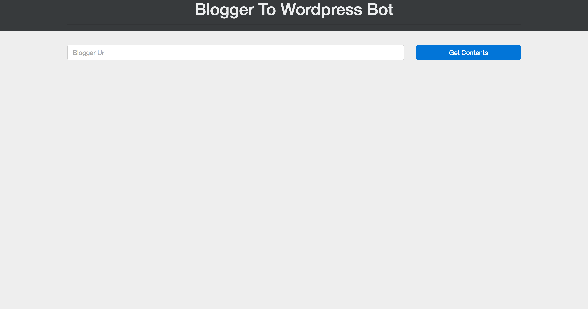
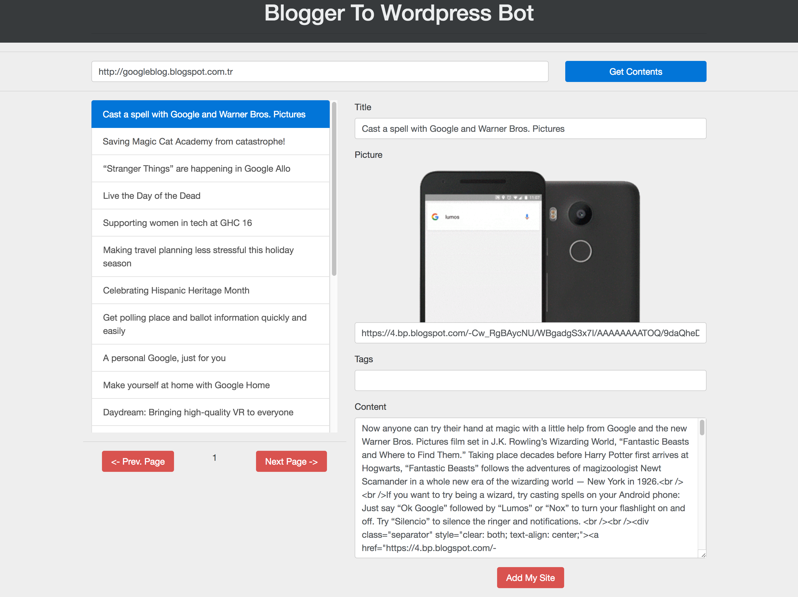

# Blogger to Wordpress Bot

Its Content Bot for Wordpress user.

  - Enter the blogger url.
  - Select and edit content.
  - Publish your wordpress.

# New Features!

  - Search the content for image and make it thumbnail.

Read Before Use:
  - Move the BloggertoWordpressBot folder to your wordpress root directory.Example:yoursite.com/BloggertoWordpressBot
  - The Blogger Link is not should finish with / character.Example: http://googleblog.blogspot.com.tr

